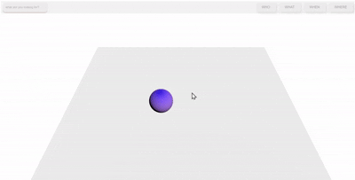

# Hi. Welcome to Orb.

### This is a side project I will be continuosly working on as I progress into my career of software development. I consider this my creative outlet for the time being.

My goal was to make a sleek website, but fun in terms of interactivity. I am working with three.js.

I think this is the start of me scratching the surface to somthing super cool.

My goal was to have this white void where the ball can be thrown wherever with realistic gravity and velocity. It's a great start I think.

I have found some really cool tools that i used to incorporate and have learned alot of css tips and tricks just working on this page alone.

Going forward I am planning to implement a day and night option on the "menu" button at the bottom. The "day time" option I might change the color of the ball, with the white background of course. And the "night time" switch would be a dark background with some stars maybe and a ominous glow. All of this with accurate shadows/illumination.

The buttons will showcase other pages- possibly other voids.
 "Orb. V0"

# Orb. V0.1

After a year into fully immersing myself into coding, we have come such a long way! Thus far I have integrated diffrent shapes, and colors. The Shapes used here I made and exported from blender. Nothing crazy but dabbling into diffrent animation skills has been very fun.

I integrated a radial pop-up menu which seems a bit sleeker than the buttons at the top. I tweaked the cube physics to be a bit more realistic.

Going forward I am focusing on expanding on the radial menu and the endless oppurtunities I can expand on. A trailing effect is my main focus going forward.

More importantly I am working on making a "blob" shape! This will definatley a learning experience in terms of blender and animation to have a rully function organic blob thats responsive to gravity and the user's clicks.

This project still remains pretty close to my heart and cannot wait to see the progression.
